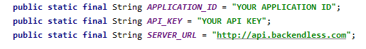
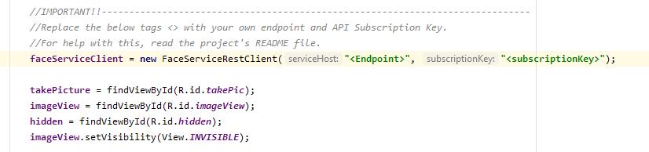

# Emo-Player
It is an Android application that detects your emotion using AI and then plays songs according to your emotion.

For this application to work you need to do two this:
  1. you need to have a backendless account where you create a database that stores the songs respective of the 
  emotions that the application detects.
  2. You need to face Microsoft Face API subscription, you can take its 7-day trail
  
  # Backendless
  After you create the database, you need to add its APPLICATION ID and API KEY in application.java class.
  
  
  
  # Adding API Key
  you need to add endpoint and subscription key value in mainActivity.java
  
